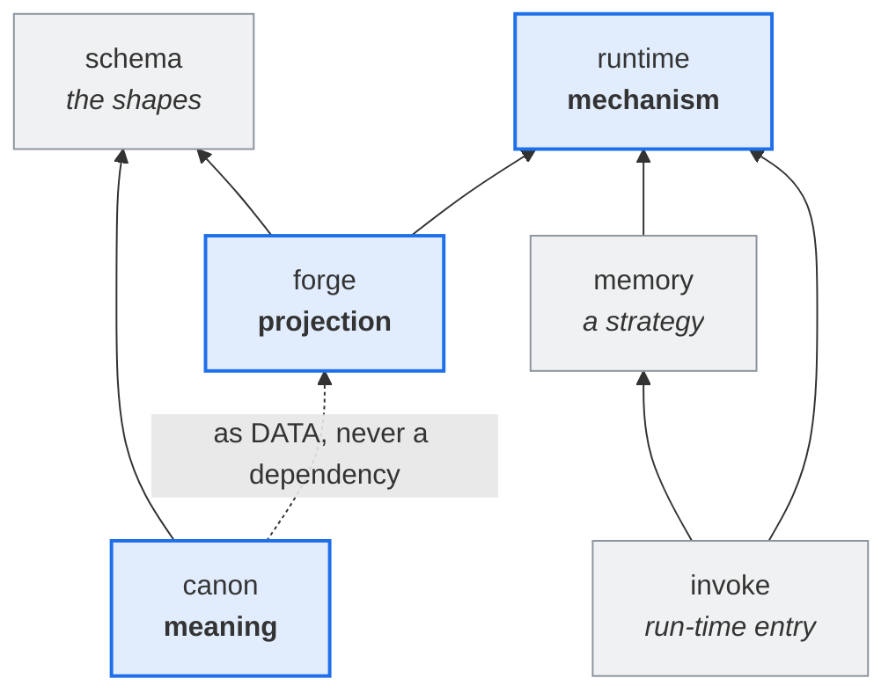

# ARCHITECTURE

> **Meaning, mechanism, and projection are three concerns. Each has one home.**

This document states the **intended** architecture — the target the source converges upon. It is
hand-authored ground, of the same nature as [`VISION.md`](./VISION.md) and [`MODEL.md`](./MODEL.md):
never generated from source, and never revised to match what the source currently does. Where the
two disagree, the source is wrong.

## The three concerns

A working agent is three separable things that the industry routinely fuses:

| concern        | what it answers                        | home      |
| -------------- | -------------------------------------- | --------- |
| **meaning**    | what this agent IS, what a skill MEANS | `canon`   |
| **mechanism**  | the programmatic thing that runs       | `runtime` |
| **projection** | how both reach a particular harness    | `forge`   |

Fusing any two is the defect this architecture exists to prevent. A canon cell that names a file path
has fused meaning with projection. A projector that decides which dimensions exist has fused
projection with meaning. A skill that embeds its own implementation has fused meaning with mechanism.

## A skill is a tool the harness would not let you install

This is the observation that makes the runtime necessary, and it is worth stating plainly because
everything downstream follows from it.

Conceptually, **a skill and a tool are the same thing**: a capability the agent invokes. The
difference is administrative — most harnesses will not accept a new tool, but will accept a _skill_
with companion scripts. The skill format is therefore a **plug-in mechanism for harnesses that have
no plug-in mechanism**.

So a skill has two faces:

- its **semantic routing** — what it means, when it applies, what it composes from. That is canon.
- the **programmatic thing it routes to** — that is runtime.

The projection wires the two together for a given harness.

## The fidelity ladder

The same shape governs every capability, and it generalizes the bound/steer rule already proven for
enforcing constraints. A harness offers some, all, or none of what the canon declares, and the
adapter realizes the **highest fidelity available**:

| fidelity    | when                                  | example                                            |
| ----------- | ------------------------------------- | -------------------------------------------------- |
| **proxy**   | the harness has the facility natively | a memory strategy that delegates to the host's own |
| **provide** | the harness lacks it                  | our implementation behind the same port            |
| **declare** | neither is possible                   | the rule reaches the agent as prose — a steer      |

**A shortfall degrades and warns; it never refuses and never widens.** Degrading changes how strongly
a subject is bound. Widening changes _which_ subjects are bound, which is a different constraint
wearing this one's name.

The floor is never silence. Every declaration reaches the agent regardless of what the harness can
mechanize, which is what makes a warning sufficient where the loss of the declaration would demand a
refusal.

## The packages

### `canon` — meaning

Signified fragments and their composites: agents, skills, rules. Harness-agnostic **and
runtime-agnostic** — it says what an agent _is_ and what a skill _means_, never how either is carried.

ESM imports are the composition substrate. A fragment is addressed by **import binding**, never by
string id, so composition is checked by the compiler rather than resolved by a registry. That is not
an implementation convenience: it is what makes a composite's parts traceable to their one home.

Canon owns the **catalog** — which dimensions exist — because a dimension is _constitutive_:
declaring one makes it part of that corpus's agent design.

**Why `canon` survived the scope rename, stated correctly.** It is tempting to say the name was kept
because the public mark escaped a prescriptive connotation `canon` carries. That reason is false:
read cold, **`Cratylus` fires prescriptive too** — a blind reader calls the tool _normative_ and
_opinionated_, and takes it to assert that correctness is discoverable rather than negotiable. That
prior rides with the naturalist commitment itself, not with the word `canon`, so no replacement
escapes it. `canon` is kept because it **names the corpus accurately**: a validated, versioned,
admitted body with a boundary. The right reason, not the convenient one.

### `runtime` — mechanism

The generic platform beneath the two things that need programmatic support:

1. **the tools skills route to** — the implementations behind the semantic surface;
2. **lifecycle guardrails** — enforcement of stances the agent would otherwise drift out of, the same
   species as a harness's own goal check.

Structured as **ports** (the abstraction) and **strategies** (the interchangeable implementations).
Every capability is pluggable, so a rich harness gets a proxying strategy and a poor one gets ours,
selected by configuration rather than by code.

It ships **with** the agent and runs on the host. It knows no harness and no corpus.

### `forge` — projection

The deterministic map from canon's meaning and runtime's capabilities onto **one** harness's surfaces.
It chooses achievable fidelity and emits accordingly.

Forge owns nothing semantic and nothing mechanical — **only the mapping**. Anything it _decides_
about the design, rather than _carries_, is a defect. That single rule is the audit criterion for this
package.

### `schema` — the shapes

The shapes a corpus authors against: what a cell is, what a value is, what carries enforcement —
[`MODEL.md`](./MODEL.md) realized in types. It belongs to **neither** canon nor forge: canon authors
against it, forge validates and projects against it, and it holds no opinion about either.

Extracting it is what let meaning and projection stop depending on each other. **Landed 2026-08-04**: canon cells importing the projector went **22 → 0**, and the render oracle did not move a byte — the proof the change was structural.

The sign was discovered, not chosen, and it carries its own constraint: asked what `schema`
would be beside these siblings, a reader with no access to this document answers _"the other three
would depend on it, not the reverse — schema packages sit at the bottom of the dependency graph"_,
and places content in canon and execution in runtime unprompted. **That is properties 2 and 4 below,
recovered from the name alone.** It replaces a working title of `agent-anatomy`, which could not be
used: `anatomy` was a metaphor binding four distinct concepts, and `agent-anatomy` was already
`canon`'s own package name before `2f9bd6e5`.

### `memory` — a runtime strategy

One implementation behind the memory port, not a peer of the three concerns. Named here only because
its package sits alongside them.

### Two consumer entries, because there are two DAGs

A consumer meets this system at two different times, and they are not the same entry:

| when           | what it answers                                       | shipped by         | bin            | typed by    |
| -------------- | ----------------------------------------------------- | ------------------ | -------------- | ----------- |
| **build time** | author, resolve, project and deploy a corpus          | `@cratylus/forge`  | `cratylus`     | **a human** |
| **run time**   | the capabilities an agent invokes while it is running | `@cratylus/invoke` | `cratylus-run` | **a shim**  |

This is not two ways of doing one thing. It is the **same decomplection the plugin contract already
makes one level down**: a capability package exposes `buildPlugin` (its `AgentPlugin` face) and
`runtimePlugin` (its `RuntimePlugin` face), never one dual-hook object, so the build DAG and the
runtime DAG never reach across. The two bins are that seam surfacing as installable commands.

**Two bins, and the last column is why.** Merging them into one command with two groups was live and
was rejected: the run-time bin is invoked almost entirely by _generated artifacts_ — the projected
`scripts/<capability>.mjs` shims and the generated hook workers — so merging would not take a human
from two names to one. It would take them from `cratylus project` to `cratylus build project`,
lengthening the surface that _is_ typed to shorten one that is machine-written and free. Worse, one
bin means one package owns the `bin` key and must depend on **both** DAGs, so a host that only runs
agents would drag the whole projection machinery — re-coupling at distribution exactly what `invoke`
exists to keep apart.

**The brevity budget went to the human surface.** That inverted this shard's first guess
(`cratylus` + `cratylus-forge`), which put the fourteen-character compound on the typed surface and
the bare mark on the machine-written one. `-forge` is also redundant once `forge` is the only
build-time package.

**`invoke` ships the bin but could not _be_ it.** `pyinvoke` already installs `invoke` and `inv` on
`PATH`. A package name is scoped and cheap; a bin name is global and unscoped, which is a strictly
harder occupancy problem — the two were derived separately for that reason. Bare `forge` was
disqualified the same way, and harder: Foundry, jboss-forge, ArrayFire, an npm `forge` and a crates
`forge` all claim it.

**Flipping `RUNTIME_BIN` really was the whole rename.** `RUNTIME_CONFIG_NAME`
(`.cratylus-run.json`) and `TAP_ID` (`cratylus-run-event-tap`) are template-derived from it and moved
without being edited — which is what `bin-name.ts` was built to buy. One second home did surface: a
`${MEMORY_BIN:-…}` shell fallback, invisible to `bin-name-single-home.test.ts` because that gate
asserts on TypeScript source and this was a `.sh`. **The gate's coverage stops at the language
boundary**, and the emitted-artifact sites are exactly where a missed rename fails on a host rather
than at build.

**Everything a consumer can do at build time belongs to `forge`'s command surface**, and
anything in this repository that performs such a step by another route is a divergence — a private
reimplementation of a shipped command, which is how a projector drifts from its own CLI without
anything reporting it.

**This repository is itself such a consumer.** `agents.config.ts` at the root extends the canon
plugin, and `canon:project` / `canon:project:codex` are proxies through `cratylus project
--harness <name>`; the `canon:deploy*` scripts reach the `forge` bin rather than a `dist/`
path. The two private CLIs those scripts used to drive (`canon/src/toolkit/project-cli.ts` and
`project-cli-codex.ts`) were the same program differing by one adapter string, and the corpus had
already paid for the duplication: the codex copy drifted once and shipped SESSIONLESS runtime shims
to every codex-projected skill for the life of the divergence. Both are deleted, and the render
oracle (`.render-ts` + `.render-ts-codex`) is byte-identical through the shipped command — the proof
that the private path carried no behaviour the CLI lacks.

#### `invoke` — the run-time entry

It exists **to break a dependency cycle.** Every capability package depends on the runtime for its
contracts, so the runtime cannot declare the capabilities. `invoke` is the third package that depends
on both and wires them by static import, which is what makes resolution succeed by declaration rather
than by co-installation accident. It owns the `bin` key — the one copy of the bin name no TypeScript
can compute.

**The sign was re-signified here, replacing `agent-cli`.** The retired name failed
`α(cᵢ) = α(cⱼ) ⇒ D(cᵢ) = D(cⱼ)` in both directions at once: it claimed **the** CLI while shipping one
of two, and its own bin disagreed with it. The replacement was not chosen — it survived a blind
reverse decode that killed the whole forward slate. `assembly`, `bin`, `entry`, `composition` and
`cli` each scored ≤6/10 cold; the decoder's own proposals `host`, `agent` and `shell` then failed the
occupancy check against this repository, where _host_ already names the harness executing the agent,
_agent_ is a config vector and a type, and _shell_ is process execution.

`invoke` won on a property none of the nouns had: **it is a verb, and verbs decode as leaves.**
Nothing depends on an action, so a cold reader places it at the top of the DAG unprompted and never
expects to import it for contracts — which is exactly where it sits. It also reads as a discrete call
rather than a resident process, so it does not promise the daemon `host` implied.

**Accepted residual:** the canon carries an engineering-principle dimension named
`invoke-the-canonical`. That is a compound at a different level in a different namespace — no package
or module claims the bare token — but the proximity is real and is recorded here rather than
explained away.

## The north star

The load-bearing properties, in order of how much they matter:

1. **Meaning and mechanism never reference each other.** `canon` and `runtime` share no
   edge in either direction. A skill names a capability; it does not name an implementation.
2. **Nothing depends on projection.** Forge is a leaf in the direction that matters. Canon reaches it
   only as a **build tool for canon's own scripts** — never from a cell.
3. **Canon reaches forge as DATA, not as a dependency.** The corpus is passed to the projector as a
   plugin. The dotted edge is a flow, not an import.
4. **Runtime depends on nothing.** It is the deployed base, and everything corpus-specific reaches it
   as configuration the projection emitted.

## Where the source diverges today

Stated honestly, because a north star that pretends to be a description is useless:

| divergence                                                                            | evidence                                                                                                                                                                                                                                                                                                  |
| ------------------------------------------------------------------------------------- | --------------------------------------------------------------------------------------------------------------------------------------------------------------------------------------------------------------------------------------------------------------------------------------------------------- |
| ~~**`schema` imports `runtime`**~~ — **REPAIRED 2026-08-05**                          | Schema took `RuntimePlugin` only to derive `keyof Omit<…,'name'>` — a **vocabulary** obtained by reaching into a **shape**. Schema now states only that a capability has a name; `canon/anatomy.ts` declares the members. Ports never moved, edge gone, oracle unmoved, and the cell check got _stronger_ |
| **nothing is published yet** — every version is `0.0.0`                               | resolved 2026-08-05: `private: true` retired from `invoke`, `memory`, `runtime`; all six declare `publishConfig.access: public`. The `@cratylus` org is owned. Names are free until the first publish and not after                                                                                       |
| **canon's own most structural module is still `src/anatomy.ts`** — holding `MANIFEST` | the file name is the retired sign; 154 importers reach it                                                                                                                                                                                                                                                 |
| **a canon cell names the runtime's binary** — projection knowledge in a cell          | `RUNTIME_BIN` in `hooks/memory-consolidation-nudge.ts`                                                                                                                                                                                                                                                    |
| **the lifecycle vocabulary is declared twice** — forge and runtime, independently     | 28 members each, identical set and order, nothing enforcing it                                                                                                                                                                                                                                            |
| **property 1 is breached, and a GATE PINS THE BREACH**                                | `src/hooks/memory-consolidation-nudge.ts:2` — a canon **cell** — imports `RUNTIME_BIN` from `@cratylus/runtime`, and `test/bin-name-single-home.test.ts:57,101` asserts it stays                                                                                                                          |
| **`FIXTURE_ANATOMY`** — the fixture corpus's instance of the same concept             | ~110 sites in `forge/test`, now read as `manifest: FIXTURE_ANATOMY`                                                                                                                                                                                                                                       |

**The property-1 row is the one that matters most.** Property 1 is the highest-ranked property here,
and the repository does not merely fail it: a test **requires** the failure, so repairing the
architecture turns the suite red. That is not a defect to fix in passing. Amending the counter-gate is
a design decision, and it comes first.

**All four properties are now enforced** by `canon/test/architecture.test.ts`, which reads every
workspace package's real import graph and pins each breach above. Every row here is therefore a live
ratchet entry rather than a claim — it fails the suite the day it is repaired, and it cannot silently
grow.

The third row is why this whole class persisted. These four properties are the load-bearing claims of
this document and **nothing has ever checked any of them**. A property stated only in prose is a
property that drifts silently — which is the same lesson the corpus already learned about signs, one
level up. **The gate is owed before the repairs are, or the repairs will not hold.**

Canon's **build scripts** importing forge (`project`, `deploy`, `validate`, `module-scan`) is _not_ a
divergence — those are canon's build steps using the projector as a tool, which is what a tool is for.
The divergence is a **cell** importing it. Keep that distinction: it is the difference between a
corpus that is built by forge and a corpus that is defined by it.
