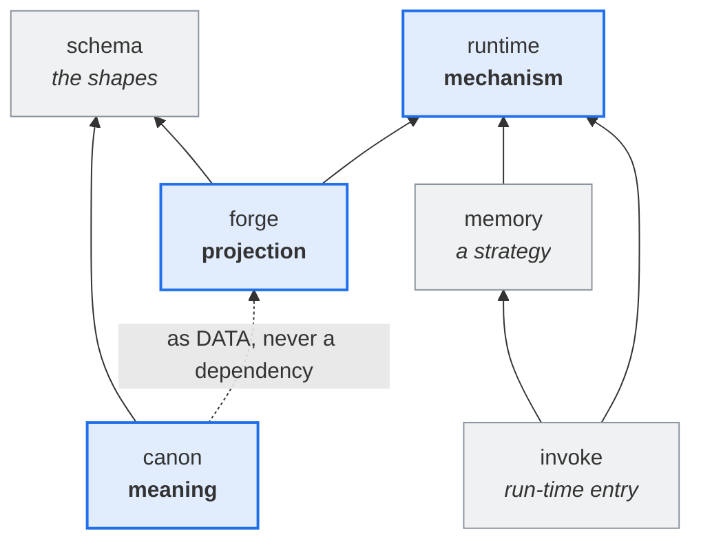

# ARCHITECTURE

> **Meaning, mechanism, and projection are three concerns. Each has one home.**

This document states the **intended** architecture — the target the source converges upon. It is
hand-authored ground, of the same nature as [`VISION.md`](./VISION.md) and [`MODEL.md`](./MODEL.md):
never generated from source, and never revised to match what the source currently does. Where the
two disagree, the source is wrong.

## The three concerns

A working agent is three separable things that the industry routinely fuses:

| concern        | what it answers                        | home      |
| -------------- | -------------------------------------- | --------- |
| **meaning**    | what this agent IS, what a skill MEANS | `canon`   |
| **mechanism**  | the programmatic thing that runs       | `runtime` |
| **projection** | how both reach a particular harness    | `forge`   |

Fusing any two is the defect this architecture exists to prevent. A canon cell that names a file path
has fused meaning with projection. A projector that decides which dimensions exist has fused
projection with meaning. A skill that embeds its own implementation has fused meaning with mechanism.

## A skill is a tool the harness would not let you install

This is the observation that makes the runtime necessary, and it is worth stating plainly because
everything downstream follows from it.

Conceptually, **a skill and a tool are the same thing**: a capability the agent invokes. The
difference is administrative — most harnesses will not accept a new tool, but will accept a _skill_
with companion scripts. The skill format is therefore a **plug-in mechanism for harnesses that have
no plug-in mechanism**.

So a skill has two faces:

- its **semantic routing** — what it means, when it applies, what it composes from. That is canon.
- the **programmatic thing it routes to** — that is runtime.

The projection wires the two together for a given harness.

## The fidelity ladder

The same shape governs every capability, and it generalizes the bound/steer rule already proven for
enforcing constraints. A harness offers some, all, or none of what the canon declares, and the
adapter realizes the **highest fidelity available**:

| fidelity    | when                                  | example                                            |
| ----------- | ------------------------------------- | -------------------------------------------------- |
| **proxy**   | the harness has the facility natively | a memory strategy that delegates to the host's own |
| **provide** | the harness lacks it                  | our implementation behind the same port            |
| **declare** | neither is possible                   | the rule reaches the agent as prose — a steer      |

**A shortfall degrades and warns; it never refuses and never widens.** Degrading changes how strongly
a subject is bound. Widening changes _which_ subjects are bound, which is a different constraint
wearing this one's name.

The floor is never silence. Every declaration reaches the agent regardless of what the harness can
mechanize, which is what makes a warning sufficient where the loss of the declaration would demand a
refusal.

## The packages

### `canon` — meaning

Signified fragments and their composites: agents, skills, rules. Harness-agnostic **and
runtime-agnostic** — it says what an agent _is_ and what a skill _means_, never how either is carried.

ESM imports are the composition substrate. A fragment is addressed by **import binding**, never by
string id, so composition is checked by the compiler rather than resolved by a registry. That is not
an implementation convenience: it is what makes a composite's parts traceable to their one home.

Canon owns the **catalog** — which dimensions exist — because a dimension is _constitutive_:
declaring one makes it part of that corpus's agent design.

**Why `canon` survived the scope rename, stated correctly.** It is tempting to say the name was kept
because the public mark escaped a prescriptive connotation `canon` carries. That reason is false:
read cold, **`Cratylus` fires prescriptive too** — a blind reader calls the tool _normative_ and
_opinionated_, and takes it to assert that correctness is discoverable rather than negotiable. That
prior rides with the naturalist commitment itself, not with the word `canon`, so no replacement
escapes it. `canon` is kept because it **names the corpus accurately**: a validated, versioned,
admitted body with a boundary. The right reason, not the convenient one.

### `runtime` — mechanism

The generic platform beneath the two things that need programmatic support:

1. **the tools skills route to** — the implementations behind the semantic surface;
2. **lifecycle guardrails** — enforcement of stances the agent would otherwise drift out of, the same
   species as a harness's own goal check.

Structured as **ports** (the abstraction) and **strategies** (the interchangeable implementations).
Every capability is pluggable, so a rich harness gets a proxying strategy and a poor one gets ours,
selected by configuration rather than by code.

It ships **with** the agent and runs on the host. It knows no harness and no corpus.

### `forge` — projection

The deterministic map from canon's meaning and runtime's capabilities onto **one** harness's surfaces.
It chooses achievable fidelity and emits accordingly.

Forge owns nothing semantic and nothing mechanical — **only the mapping**. Anything it _decides_
about the design, rather than _carries_, is a defect. That single rule is the audit criterion for this
package.

### `schema` — the shapes

The shapes a corpus authors against: what a cell is, what a value is, what carries enforcement —
[`MODEL.md`](./MODEL.md) realized in types. It belongs to **neither** canon nor forge: canon authors
against it, forge validates and projects against it, and it holds no opinion about either.

Extracting it is what let meaning and projection stop depending on each other. **Landed 2026-08-04**: canon cells importing the projector went **22 → 0**, and the render oracle did not move a byte — the proof the change was structural.

The sign was discovered, not chosen, and it carries its own constraint: asked what `schema`
would be beside these siblings, a reader with no access to this document answers _"the other three
would depend on it, not the reverse — schema packages sit at the bottom of the dependency graph"_,
and places content in canon and execution in runtime unprompted. **That is properties 2 and 4 below,
recovered from the name alone.** It replaces a working title of `anatomy`, which could not be
used: `anatomy` was a metaphor binding four distinct concepts, and `anatomy` was already
`canon`'s own package name before `2f9bd6e5`.

### `memory` — a runtime strategy

One implementation behind the memory port, not a peer of the three concerns. Named here only because
its package sits alongside them.

### `cli` — the one consumer entry

A consumer installs one package and types one command.

```sh
npm install -g cratylus
```

`cratylus` is the only package with an executable shape, and the only one permitted to know all
three concerns at once. `forge` projects and depends on no corpus; `canon` is a corpus and knows no
projector; something has to hold both for a consumer to type one command, and this is it. It owns
the `bin` key — the one copy of the command's name no TypeScript can compute.

Everything it composes is an ordinary ESM library. `forge` exports `runCli` for the build surface,
`runtime` exports `runCli` for capability dispatch, `canon` default-exports the corpus. The entry
imports all three statically and routes: capability verbs to the runtime, everything else to the
projector.

**One command, not two.** `cratylus` and `cratylus-run` were separate bins because the two surfaces
lived in two packages and each built its own `cac`. The two DAGs that split defended are a fact
about **imports** — which the bundler and the package manager already handle — not a fact that has
to surface as two names a consumer must learn. A capability verb is `cratylus memory encode`, and
the generated shims that invoke it spell one name.

**What the merge costs, stated because it is a cost.** A host that only runs agents now installs the
projector and the corpus along with the runtime. `await import()` cannot defer that: dynamic import
defers **evaluation**, never **installation**. The bill is paid where it is visible — the e2e gate
lists the full dependency closure it installs — and it buys a consumer one install instead of a
seam they never asked about.

## The north star



The load-bearing properties, in order of how much they matter:

1. **Meaning and mechanism never reference each other.** `canon` and `runtime` share no
   edge in either direction. A skill names a capability; it does not name an implementation.
2. **Nothing depends on projection.** Forge is a leaf in the direction that matters. Canon reaches it
   only as a **build tool for canon's own scripts** — never from a cell.
3. **Canon reaches forge as DATA, not as a dependency.** The corpus is passed to the projector as a
   plugin. The dotted edge is a flow, not an import.
4. **Runtime depends on nothing.** It is the deployed base, and everything corpus-specific reaches it
   as configuration the projection emitted.

## Where the source diverges today

Stated honestly, because a north star that pretends to be a description is useless.

**This table is a REPORT, and it is the only part of this document that is.** Everything above it —
the north star and the four properties — is ground: never revised to match what the source currently
does, and where the two disagree the source is wrong. The table's function is the opposite. It states
where the source stands _today_, so it is rewritten whenever the source moves, and a struck row is a
repair that landed. Nothing above the table changes because the source changed.

| divergence                                                                                     | evidence                                                                                                                                                                                                                                                                                                                                                                                                                                                                                                                                                                                                                      | held by                                                                                                                                                                                                                                                                                                                                                                                           |
| ---------------------------------------------------------------------------------------------- | ----------------------------------------------------------------------------------------------------------------------------------------------------------------------------------------------------------------------------------------------------------------------------------------------------------------------------------------------------------------------------------------------------------------------------------------------------------------------------------------------------------------------------------------------------------------------------------------------------------------------------- | ------------------------------------------------------------------------------------------------------------------------------------------------------------------------------------------------------------------------------------------------------------------------------------------------------------------------------------------------------------------------------------------------- |
| ~~**`schema` imports `runtime`**~~ — **REPAIRED 2026-08-05**                                   | Schema took `RuntimePlugin` only to derive `keyof Omit<…,'name'>` — a **vocabulary** obtained by reaching into a **shape**. Schema now states only that a capability has a name; `canon/manifest.ts` declares the members. Ports never moved, edge gone, oracle unmoved, and the cell check got _stronger_                                                                                                                                                                                                                                                                                                                    | `architecture.test.ts` — _"every other edge is one the architecture permits"_. `schema → runtime` appears in no `PERMITTED` pair, so the edge's return fails that leg                                                                                                                                                                                                                             |
| ~~**canon's ROOT imports the projector**~~ — **REPAIRED 2026-08-05**                           | `canon/src/index.ts` took `defineAgentPlugin` from `@cratylus/forge/resolve` — the corpus reaching into the projector for its own authoring surface, and the last breach of **property 2**. `AgentPlugin` never depended on forge: it imported one type from the schema and the factory is `(plugin) => plugin`. Moved to `@cratylus/schema`; **property 2 now holds with no exceptions**                                                                                                                                                                                                                                     | `architecture.test.ts` — the property-2 leg, plus the exact count _"canon root modules importing the projector"_ = 0                                                                                                                                                                                                                                                                              |
| ~~**nothing is published yet** — every version is `0.0.0`~~ — **CLOSED 2026-08-06**            | five packages are on npm at `0.1.1` — `forge`, `invoke`, `memory`, `runtime`, `schema` (`npm view @cratylus/<pkg> version`) — shipped by the changesets Release PRs `36f988b7` (#7) and `454f18f3` (#8); `npm view @cratylus/forge time --json` dates `0.1.0` to `2026-08-06T10:40:54Z` and `0.1.1` to `2026-08-06T11:05:44Z`. `canon` is **not** published (`npm view @cratylus/canon` → 404) and its manifest still reads `0.0.0`, as does private `tooling`. **Names are no longer free.** Why `canon` was held back is not recorded anywhere this document can cite — the structure is stated, the motive is not inferred | **nothing** — but not for the reason this column used to give. It said no test reads a `version`; `version-single-home.test.ts` does, and did when that was written. What it holds is that the **manifest is the version's sole home** — never what the version IS or whether it shipped. `publishConfig` is read by nothing outside the six manifests declaring it (`git grep -l publishConfig`) |
| ~~**canon's own most structural module is still `src/anatomy.ts`**~~ — **REPAIRED 2026-08-05** | the module is `src/manifest.ts`. This row's count has been wrong twice over: `154` was quoted forward and never measured, and the `169 src + 6 test` that replaced it does not sum to its own `177`. Measured with `git grep -lE "from '[^']*manifest\.js'" -- packages/canon/src packages/canon/test`: **171 `src` + 6 `test` = 177**, at `9dad9455`, the commit that wrote the row                                                                                                                                                                                                                                          | the module PATH only, by named anchor in two gates: `architecture.test.ts` expects the edge `canon/manifest.ts → schema`, and `event-vocabulary.test.ts` reads `canon/src/manifest.ts` and requires `CANONICAL_EVENTS` in it. Nothing forbids the retired sign returning elsewhere                                                                                                                |
| ~~**a canon cell names the runtime's binary**~~ — **REPAIRED 2026-08-05**                      | the cell now names a FACT, not a value: `workers[].content` carries `{{fact:runtime-bin}}` and the projector substitutes at emission. The byte-anchor was not weakened — its subject moved from the cell's literal to the resolved bytes                                                                                                                                                                                                                                                                                                                                                                                      | `architecture.test.ts`, the property-1 count (`canon → runtime` = 0); and `bin-name-single-home.test.ts` — no consumer spells the name, every hook artifact defaults `$MEMORY_BIN` to `CLI_BIN`, no emitted artifact ships an unresolved placeholder                                                                                                                                              |
| ~~**the lifecycle vocabulary is declared twice**~~ — **REPAIRED `2b4a87d0`, 2026-08-05**       | and the row was wrong on its own terms about _which_ two sites: the duplicate was runtime ↔ **schema**, never runtime ↔ forge, as `runtime/src/events.ts`'s own header records. 28 members in each copy, identical as sets and in order, agreeing only because the two consumer sets were disjoint. Both copies are gone — that module now declares `export type EventName = string` and nothing else, and canon's `manifest.ts` is the sole home (`CANONICAL_EVENTS`)                                                                                                                                                        | `event-vocabulary.test.ts`, all three legs: a sole-declaring-site census over `packages/*/src`, adapter-key conformance against canon's tuple, and a deploy→runtime config round trip through a real file                                                                                                                                                                                         |
| ~~**property 1 is breached, and a GATE PINS THE BREACH**~~ — **REPAIRED 2026-08-05**           | the pin is gone and `ARCHITECTURE_RATCHET` is **empty**. Property 1 holds with no exceptions. The counter-gate was amended first, as this document required, then the import was deleted                                                                                                                                                                                                                                                                                                                                                                                                                                      | `architecture.test.ts` — the property-1 leg, its exact count, and the shrink-only leg, which is what makes an _empty_ ratchet mean something rather than nothing                                                                                                                                                                                                                                  |
| ~~**`FIXTURE_ANATOMY`**~~ — **REPAIRED 2026-08-05**                                            | now `FIXTURE_MANIFEST`. `git grep -o FIXTURE_MANIFEST -- packages` gives **75 occurrences across 17 files** at `9dad9455` — not the `~110` this row claimed, and it was already 75 at the very commit that WROTE `~110`, so that figure was never measured at all                                                                                                                                                                                                                                                                                                                                                             | **nothing.** TypeScript holds the symbol's internal consistency whatever it is called; no gate prohibits the retired sign from returning                                                                                                                                                                                                                                                          |

**Property 1 held on 2026-08-05, and the ratchet is empty.** It was the highest-ranked property and
the hardest: a test REQUIRED the failure, so repairing the architecture turned the suite red, and
both escapes were closed on purpose — the cell had to CARRY the bin's value and was forbidden to
spell it. The counter-gate was amended first, exactly as this document demanded, and the replacement
leg is strictly stronger: it sweeps every emitted hook artifact rather than one hand-named file.

**The trade is recorded, because it is a trade.** A cell reaching the runtime became a build script
reaching the projector — licensed by property 2, which permits canon's build steps to use forge as a
tool. Canon's licensed build scripts went 4 → 5.

**What the third column says, and what it does not.** The four properties are enforced by
`canon/test/architecture.test.ts`, which reads every workspace package's real import graph. That gate
holds **import-graph edges and nothing else**, so it reaches five of the eight rows above and no
more. Its shrink-only pin set `ARCHITECTURE_RATCHET` is **empty**, which means no row above is a pin.
This paragraph replaces one that said every row here was a live ratchet entry, and so failed the
suite the day it was repaired; that is a property of pins, and there have been none since 2026-08-05.
Where it leaves the rest:

- a **DRY breach across two packages** is not an edge. The lifecycle-vocabulary row was one, and the
  gate that holds it had to be written separately — three legs, two of which the type system cannot
  reach at all, because an adapter map keys over open strings and a host config is bytes.
- a **rename** is not an edge either. `src/anatomy.ts → src/manifest.ts` survives only because two
  gates happen to name the new path out loud, which is an anchor rather than a rule; and
  `FIXTURE_ANATOMY → FIXTURE_MANIFEST` is held by nothing, because the compiler keeps a symbol's
  uses consistent with its declaration whatever that declaration is called.
- **nothing is published yet** was held by nothing at all, and it is the second row to prove what
  that costs: it went false at `2026-08-06T10:40:54Z`, when the first publish landed, and read as
  live for the rest of that day. **No row in this table is unstruck now.**

Two rows held by nothing is the honest count, not a gap to be talked away. This table has now proved
twice what an unheld row does. The lifecycle-vocabulary row asserted a condition that had been
repaired and gated at `2b4a87d0`, and it read as live for a day beneath a sentence claiming every row
here was a live ratchet entry. It was not one, no ratchet entry existed, and the claimed guard did
not cover the class. The publish row failed the same way in the opposite direction — it claimed a
divergence that had already closed — and no gate could report it, because the one test that reads a
`version` holds **where the version lives**, never **what it is**, and publish status is a fact about
npm that no gate here asks for. **A property stated only in prose is a property that drifts
silently** — the lesson this section already carried, applied to the section itself, twice.

**A third instance surfaced in the same pass, and it is the worst shape of the three.** The row's
own evidence column asserted that _no test reads a `version`_ — false on the day it was written, with
`version-single-home.test.ts` sitting in the suite. That is a **false premise beneath a true
conclusion**: the row's verdict (_held by nothing_) was correct, so nothing about the outcome looked
wrong, and the wrong reason survived every reading. It was corrected only by re-running the claim
rather than re-reading it.

**Every count in the evidence column names its command and the commit it was taken at.** A bare count
of the live tree is the same defect one level down: it is true on the day it is written and unowned
afterwards. This table has carried three wrong ones — a `~110` that was 75 at the very commit that
wrote it, a `154` that was 177, and a `169 + 6` that does not sum to the `177` printed beside it. A
measurement anchored to a commit stays true; re-run the command for today's figure.

Canon's **build scripts** importing forge is _not_ a divergence — those are canon's build steps using
the projector as a tool, which is what a tool is for. The divergence is a **cell** importing it. Keep
that distinction: it is the difference between a corpus that is built by forge and a corpus that is
defined by it. There are five such scripts — the count `architecture.test.ts` pins — and
`git grep -lE "from '@cratylus/forge" -- packages/canon/tooling` names them. That command read
`packages/canon/src` until 2026-08-06 and returned **0**, because the scripts moved to `tooling/`, a
sibling of `src/` rather than a child. The gate did not drift with it — `architecture.test.ts` scans
both roots and still pins 5 — so this was a stale command beside a live count, which is the harder
failure to see: the number stayed right while the way to check it stopped working.
