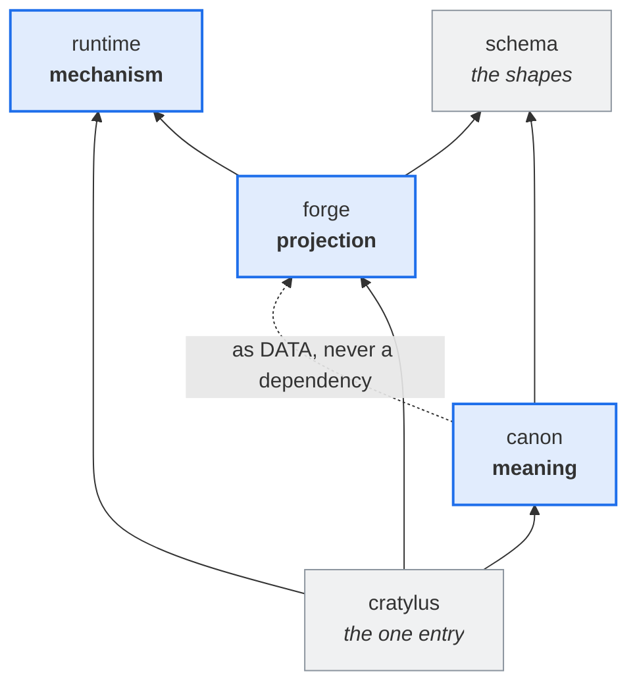

# ARCHITECTURE

> **Meaning, mechanism, and projection are three concerns. Each has one home.**

This document states the **intended** architecture — the target the source converges upon. It is
hand-authored ground, of the same nature as [`VISION.md`](./VISION.md) and [`MODEL.md`](./MODEL.md):
never generated from source, and never revised to match what the source currently does. Where the
two disagree, the source is wrong.

## The three concerns

A working agent is three separable things that the industry routinely fuses:

| concern        | what it answers                        | home      |
| -------------- | -------------------------------------- | --------- |
| **meaning**    | what this agent IS, what a skill MEANS | `canon`   |
| **mechanism**  | the programmatic thing that runs       | `runtime` |
| **projection** | how both reach a particular harness    | `forge`   |

Fusing any two is the defect this architecture exists to prevent. A canon cell that names a file path
has fused meaning with projection. A projector that decides which dimensions exist has fused
projection with meaning. A skill that embeds its own implementation has fused meaning with mechanism.

## A skill is a tool the harness would not let you install

This is the observation that makes the runtime necessary, and it is worth stating plainly because
everything downstream follows from it.

Conceptually, **a skill and a tool are the same thing**: a capability the agent invokes. The
difference is administrative — most harnesses will not accept a new tool, but will accept a _skill_
with companion scripts. The skill format is therefore a **plug-in mechanism for harnesses that have
no plug-in mechanism**.

So a skill has two faces:

- its **semantic routing** — what it means, when it applies, what it composes from. That is canon.
- the **programmatic thing it routes to** — that is runtime.

The projection wires the two together for a given harness.

## The fidelity ladder

The same shape governs every capability, and it generalizes the bound/steer rule already proven for
enforcing constraints. A harness offers some, all, or none of what the canon declares, and the
adapter realizes the **highest fidelity available**:

| fidelity    | when                                  | example                                            |
| ----------- | ------------------------------------- | -------------------------------------------------- |
| **proxy**   | the harness has the facility natively | an event tap that installs into Claude's own hooks |
| **provide** | the harness lacks it                  | our implementation behind the same port            |
| **declare** | neither is possible                   | the rule reaches the agent as prose — a steer      |

**A shortfall degrades and warns; it never refuses and never widens.** Degrading changes how strongly
a subject is bound. Widening changes _which_ subjects are bound, which is a different constraint
wearing this one's name.

The floor is never silence. Every declaration reaches the agent regardless of what the harness can
mechanize, which is what makes a warning sufficient where the loss of the declaration would demand a
refusal.

## The packages

### `canon` — meaning

Signified fragments and their composites: agents, skills, rules. Harness-agnostic **and
runtime-agnostic** — it says what an agent _is_ and what a skill _means_, never how either is carried.

ESM imports are the composition substrate. A fragment is addressed by **import binding**, never by
string id, so composition is checked by the compiler rather than resolved by a registry. That is not
an implementation convenience: it is what makes a composite's parts traceable to their one home.

Canon owns the **catalog** — which dimensions exist — because a dimension is _constitutive_:
declaring one makes it part of that corpus's agent design.

**Why `canon` survived the scope rename, stated correctly.** It is tempting to say the name was kept
because the public mark escaped a prescriptive connotation `canon` carries. That reason is false:
read cold, **`Cratylus` fires prescriptive too** — a blind reader calls the tool _normative_ and
_opinionated_, and takes it to assert that correctness is discoverable rather than negotiable. That
prior rides with the naturalist commitment itself, not with the word `canon`, so no replacement
escapes it. `canon` is kept because it **names the corpus accurately**: a validated, versioned,
admitted body with a boundary. The right reason, not the convenient one.

### `runtime` — mechanism

The generic platform beneath **the tools skills route to** — the implementations behind the semantic
surface.

Its capabilities — `eventTap`, `design`, `plan` and `note` — are **built into the runtime** and known
when it is built: nothing is discovered, no plugin is loaded, and no configuration chooses a provider.
Each is reached through its **port**. The event tap's Claude strategy is the case with
interchangeable implementations: it proxies Claude's own hooks from behind the event tap's port,
where another harness's strategy would stand in its place.

It ships **with** the agent and runs on the host. It knows no corpus: the corpus's event vocabulary and
each capability's configuration reach it in the host config that deploy writes.

It knows no harness beyond the event tap's Claude strategy, which writes Claude's settings format, and
the tap refuses a caller whose harness has no strategy of its own; `design`, `plan` and `note` are
repository-scoped and know no harness at all.

A lifecycle guardrail is not the runtime's. It is a canon hook cell that forge projects as the
harness's own hook — on omp, as an extension module — so the runtime hosts the capabilities above and
no guard.

### `forge` — projection

The deterministic map from canon's meaning and runtime's capabilities onto **one** harness's surfaces.
It chooses achievable fidelity and emits accordingly.

Forge owns nothing semantic and nothing mechanical — **only the mapping**. Anything it _decides_
about the design, rather than _carries_, is a defect. That single rule is the audit criterion for this
package.

### `schema` — the shapes

The shapes a corpus authors against: what a cell is, what a value is, what carries enforcement —
[`MODEL.md`](./MODEL.md) realized in types. It belongs to **neither** canon nor forge: canon authors
against it, forge validates and projects against it, and it holds no opinion about either.

Extracting it is what let meaning and projection stop depending on each other. **Landed 2026-08-04**: canon cells importing the projector went **22 → 0**, and the projected corpus did not move a byte — the proof the change was structural.

The sign was discovered, not chosen, and it carries its own constraint: asked what `schema`
would be beside these siblings, a reader with no access to this document answers _"the other three
would depend on it, not the reverse — schema packages sit at the bottom of the dependency graph"_,
and places content in canon and execution in runtime unprompted. **That is properties 2 and 4 below,
recovered from the name alone.** It replaces a working title of `anatomy`, which could not be
used: `anatomy` was a metaphor binding four distinct concepts, and `anatomy` was already
`canon`'s own package name before `2f9bd6e5`.

### `cli` — the one consumer entry

A consumer installs one package and types one command.

```sh
npm install -g cratylus
```

`cratylus` is the only package with an executable shape, and the only one permitted to know all
three concerns at once. `forge` projects and depends on no corpus; `canon` is a corpus and knows no
projector; something has to hold both for a consumer to type one command, and this is it. It owns
the `bin` key — the one copy of the command's name no TypeScript can compute.

Everything it composes is an ordinary ESM library. `forge` exports the projector's commands,
`runtime` exports one command per capability, `canon` default-exports the corpus. The entry
imports all three statically and builds one Commander program from them, so its `--help` lists every
command and capability there is.

**One command, not two.** `cratylus` and `cratylus-run` were separate bins because the two surfaces
lived in two packages and each built its own command-line program. The two DAGs that split defended are a fact
about **imports** — which the bundler and the package manager already handle — not a fact that has
to surface as two names a consumer must learn. A capability verb is `cratylus design show`, and
the generated shims that invoke it spell one name.

**What the merge costs, stated because it is a cost.** A host that only runs agents now installs the
projector and the corpus along with the runtime. `await import()` cannot defer that: dynamic import
defers **evaluation**, never **installation**. The bill is paid where it is visible — the `cratylus`
manifest lists `canon`, `forge` and `runtime` as its dependencies — and it buys a consumer one install
instead of a seam they never asked about.

## The north star


```mermaid
graph BT
    schema["schema<br/><i>the shapes</i>"]
    canon["canon<br/><b>meaning</b>"]
    runtime["runtime<br/><b>mechanism</b>"]
    forge["forge<br/><b>projection</b>"]
    cli["cratylus<br/><i>the one entry</i>"]

    canon --> schema
    forge --> schema
    forge --> runtime
    cli --> runtime
    cli --> forge
    cli --> canon

    canon -. "as DATA, never a dependency" .-> forge

    classDef concern fill:#1f6feb22,stroke:#1f6feb,stroke-width:2px
    classDef support fill:#8b949e22,stroke:#8b949e
    class canon,runtime,forge concern
    class schema,cli support
```

The load-bearing properties, in order of how much they matter:

1. **Meaning and mechanism never reference each other.** `canon` and `runtime` share no
   edge in either direction. A skill names a capability; it does not name an implementation.
2. **Nothing depends on projection but the consumer entry.** Forge is a leaf in the direction that
   matters: `cli`, the composition root, imports it to build the command, and canon reaches it only as
   a **build tool for canon's own scripts** — never from a cell.
3. **Canon reaches forge as DATA, not as a dependency.** The corpus is passed to the projector as a
   plugin. The dotted edge is a flow, not an import.
4. **Runtime depends on nothing.** It is the deployed base, and everything corpus-specific reaches it
   as configuration the projection emitted.

## How the properties are held

The four properties are enforced by `packages/canon/test/architecture.test.ts`, which reads every
workspace package's real import graph. Its shrink-only pin set `ARCHITECTURE_RATCHET` is empty, so all
four hold with no exception, and a pin that stopped naming a live breach would fail the suite.

That gate holds **import-graph edges and nothing else**. What an edge cannot show needs a gate of its
own, and has one only where one was written:

- the lifecycle vocabulary has one home, `CANONICAL_EVENTS` in canon's `manifest.ts`. Two of its three
  consumers are reached by channels no compiler checks — forge's per-harness maps key over open
  strings, and the runtime reads a host config, which is bytes — so `event-vocabulary.test.ts` holds
  them.
- a package's version has one home, its manifest. `version-single-home.test.ts` holds **where** a
  version lives, never **what** it is; whether a version is published is a fact about npm that nothing
  here asks.

**A property stated only in prose is a property that drifts silently.** A claim in this document that no
gate holds is one to re-check against the tree before it is trusted. A count quoted here names its
command and the commit it was taken at, because a bare count of the live tree is true on the day it is
written and unowned afterwards.

Canon's **build scripts** importing forge is _not_ a breach — those are canon's build steps using the
projector as a tool, which is what a tool is for. The breach would be a **cell** importing it. Keep
that distinction: it is the difference between a corpus that is built by forge and a corpus that is
defined by it. `architecture.test.ts` pins the number of such scripts, and
`git grep -lE "from '@cratylus/forge" -- packages/canon/tooling` names them.
