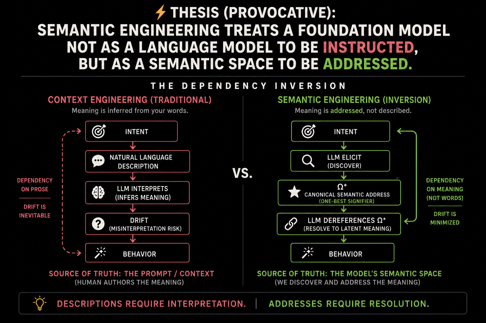

# Cratylus

> **A foundation model is not merely an engine to be instructed. It is a semantic space to be addressed.**

The discipline is **latent lexicography** — the descriptive lexicography of a foundation model's
latent vocabulary. Cratylus is its instrument. See [VISION §The discipline](./VISION.md#the-discipline).

<!-- THE ⊥ IS CLOSED. `semantic engineering` stood here until 2026-07-26, when a cold decode
     disconfirmed it against two established fields (ontology engineering / Semantic Web, and PLT
     formal-semantics engineering); the derivation returned ⊥ convergently and a definite
     description stood in, because under `cratylism` a sign is discovered or absent, never coined.
     It was found on 2026-08-05: `latent lexicography` for the discipline, `Cratylus` for the
     instrument. Both were admitted by the standard the placeholder was protecting — argmin over
     candidates, blind reverse decode, occupancy check — not by preference. The prior derivation
     record is plans/discipline-anchor/PLAN.md; the admitting evidence is VISION §The discipline. -->

