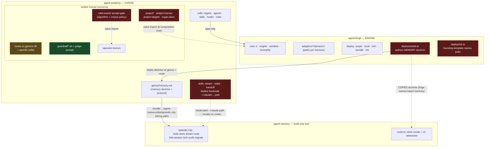
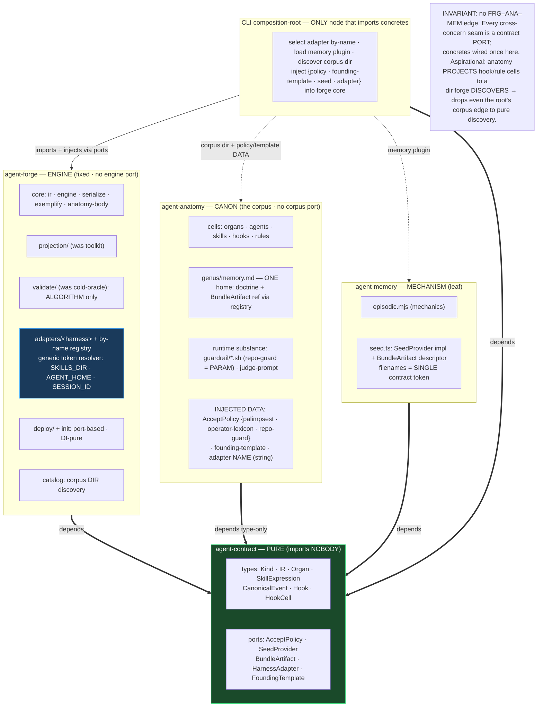
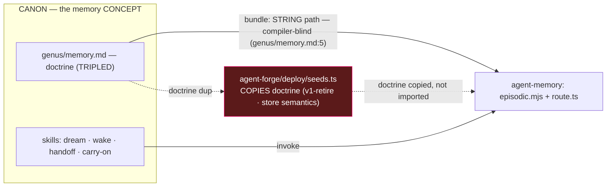
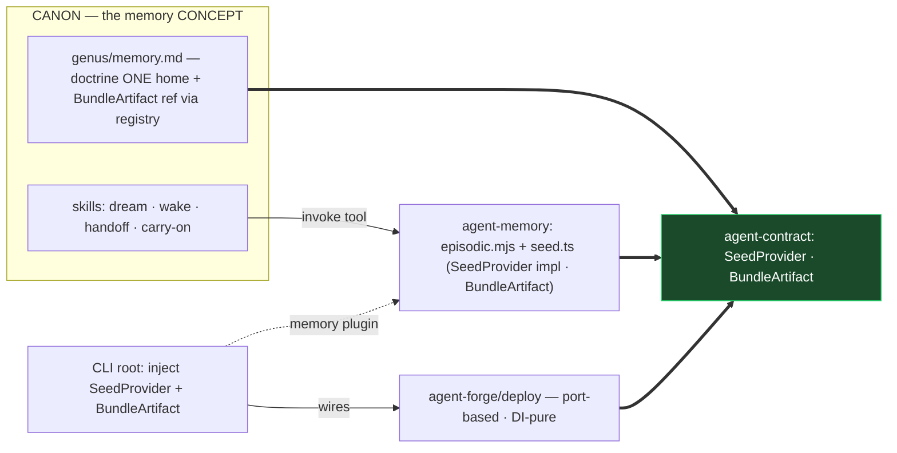

# North-star wiring — current vs target (Mermaid, v2 · decoupled)

Render in any Mermaid-aware viewer (Obsidian, GitHub, VS Code). Red = defect; blue = the fix; green = pure.
v2 = post-decoupling review: target is contract-centered with ZERO peer-to-peer package edges.

## 1. Current state (defects)

## 2. Target — contract-centered fan-in, ZERO peer-to-peer package edges

## 3. Memory as a concern — current (string-seam) vs target (typed-port)

**3a. Current — invisible string coupling + copied doctrine**

**3b. Target — doctrine one-home + typed ports through the contract**

## G-ledger — how the target closes each over-coupling (round-2 reviewer)

- **G1 type system buried in forge** → extract `agent-contract`; anatomy+forge depend on it type-only. Residual value edge (`project-human.ts:11`) removed incrementally by the project-to-directory direction.
- **G2 new concrete `forge → agent-memory`** → inverted: `SeedProvider` port in contract; memory implements; composition-root injects the concrete. forge core imports the PORT, not the package.
- **G3 bundle string seam** → `BundleArtifact` contract type; genus references it via registry, not the `genus/memory.md:5` string; filenames = single contract token.
- **G4 adapter special-cases memory** → generic path-token resolver + skills-dir; memory not special; placement spec-driven (`deploy.ts:78`); F5=(A) binds the tokens at projection.
- **G5 anatomy imports concrete adapters** → select adapter BY NAME from a registry; `project-cli.ts:29`/`project-cli-codex.ts:24` concrete imports stop; sideways `codex/anatomy.ts:23` killed via `core/anatomy-body` (D2).
- **G6 policy through forge + repo-guard `.sh` literal** → one `AcceptPolicy` object {palimpsest · operator-lexicon · repo-guard}, type in contract, `cold-oracle.sh:29` literal → param. Extended by V-init: `init.ts` founding-template must not name `polis` either (doctrine-agnosticism, both sites).
- **G7 no composition-root** → dedicated CLI root is the ONLY concrete-importing node; `deploy/` core = port-based DI-pure. Explicit in Target §2 (`ROOT`).
- **Open (by design):** project-to-directory is the adopted direction, not a round-1 blocker; until landed the root retains a DI-legal corpus-import edge.
