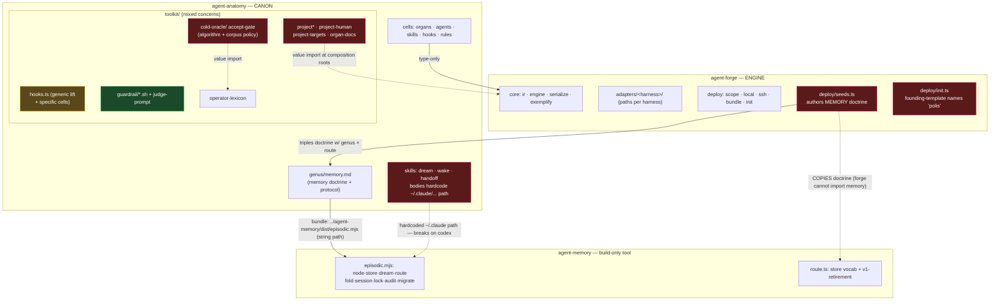
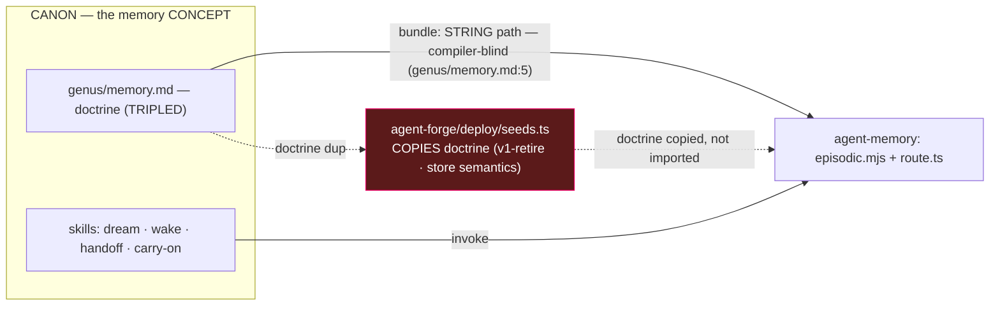
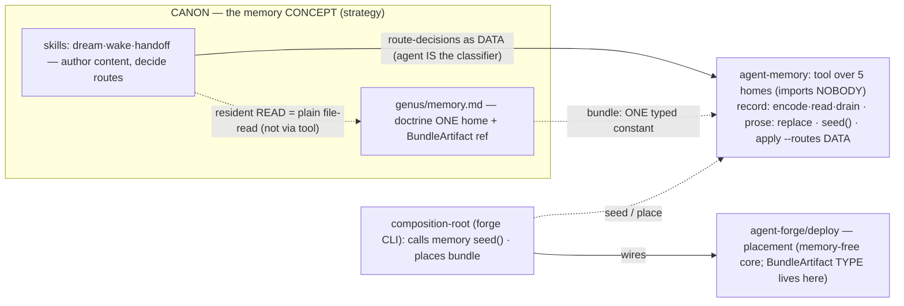

# North-star wiring — current vs target (Mermaid, v2 · decoupled)

Render in any Mermaid-aware viewer (Obsidian, GitHub, VS Code). Red = defect; blue = the fix; green = pure.
v2 = post-decoupling review: target is contract-centered with ZERO peer-to-peer package edges.

## 1. Current state (defects)



## 2. Target — 3 packages (NET-CURRENT §5.1; `agent-contract` dropped)

```mermaid
flowchart TB
  subgraph FRG["agent-forge — ENGINE + shared TYPE kernel"]
    types["TYPE kernel: Kind · IR · Organ · SkillExpression · CanonicalEvent · Hook ·<br/>HookCell · BundleArtifact(DTO) · AcceptPolicy/FoundingTemplate(data shapes)"]:::pure
    port["the ONE behavioral port: HarnessAdapter"]:::fix
    core["core: ir · engine · serialize · exemplify · anatomy-body"]
    projection["projection/ (was toolkit)"]
    validate["validate/ (was cold-oracle): ALGORITHM only (policy injected)"]
    adpt["adapters/&lt;harness&gt; + by-name registry<br/>token resolver: SKILLS_DIR · AGENT_HOME · SESSION_ID"]:::fix
    deploy["deploy/ + init: DI-pure (core is memory-free)"]
    catalog["catalog: corpus DIR discovery"]
    root["composition-root (CLI): the ONLY concrete-importing node"]:::fix
  end

  subgraph ANA["agent-anatomy — CANON"]
    cells["cells: organs · agents · skills · hooks · rules"]
    genus["genus/memory.md — ONE home: doctrine + BundleArtifact ref"]
    runtime["runtime substance: guardrail/*.sh (repo-guard = PARAM) · judge-prompt"]
    data["injected DATA VALUES: AcceptPolicy {palimpsest · operator-lexicon · repo-guard}<br/>· founding-template · adapter NAME (string)"]
  end

  subgraph MEM["agent-memory — MECHANISM (leaf, all 5 homes)"]
    tool["tool: encode·read·drain (EPISODIC) · apply --routes (DATA) · replace (prose)<br/>· seed() · lock; recall→vault only"]
  end

  ANA -->|type-only import (erases; acyclic)| types
  root -->|calls seed() · places bundle| MEM
  root -.->|discover corpus dir · read injected DATA| ANA
  genus -.->|bundle: ONE typed constant| tool
  cells -.->|"authored against"| data

  note["INVARIANTS: forge CORE imports NEITHER anatomy NOR memory. anatomy→forge is TYPE-only.<br/>Only the composition-root imports concretes. Memory imports nobody. No cycle.<br/>Aspirational: anatomy PROJECTS hook/rule cells to a dir forge DISCOVERS → drops even the type edge."]

  classDef fix fill:#1a3a5b,stroke:#4af,color:#fff;
  classDef pure fill:#1a4a2a,stroke:#2c6,color:#fff;
```

## 3. Memory as a concern — current (string-seam) vs target (typed-port)

**3a. Current — invisible string coupling + copied doctrine**



**3b. Target — doctrine one-home; tool over all homes; agent = strategy**



## G-ledger — how the target closes each over-coupling (round-2 reviewer)

> **Round-5 update:** `agent-contract` was DROPPED (NET-CURRENT §5.1). Read "contract" below as "forge's
> shared TYPE kernel"; there is no 4th package. The couplings still close — just without a new package.

- **G1 type system buried in forge** → HARDEN forge's type subpath as the shared kernel (no separate package); anatomy imports it TYPE-only. Residual value edge (`project-human.ts:11`) removed by the project-to-directory direction.
- **G2 new concrete `forge → agent-memory`** → forge CORE stays memory-free; the composition-root (forge CLI) calls `memory.seed()` and places the bundle. No `SeedProvider` port (dropped, §2.3/§5.2).
- **G3 bundle string seam** → `BundleArtifact` TYPE (in forge's kernel); genus references it via the registry, not the `genus/memory.md:5` string; filenames = single constant.
- **G4 adapter special-cases memory** → generic path-token resolver + skills-dir; memory not special; placement spec-driven (`deploy.ts:78`); F5=(A) binds the tokens at projection.
- **G5 anatomy imports concrete adapters** → select adapter BY NAME from a registry; `project-cli.ts:29`/`project-cli-codex.ts:24` concrete imports stop; sideways `codex/anatomy.ts:23` killed via `core/anatomy-body` (D2).
- **G6 policy through forge + repo-guard `.sh` literal** → one `AcceptPolicy` DATA object {palimpsest · operator-lexicon · repo-guard} (shape-type in forge's kernel, VALUES from CANON), `cold-oracle.sh:29` literal → param. Extended by V-init: `init.ts` founding prose/PLAN_STATES must not live in the engine either (doctrine-agnosticism, both sites).
- **G7 no composition-root** → dedicated CLI root is the ONLY concrete-importing node; `deploy/` core = port-based DI-pure. Explicit in Target §2 (`ROOT`).
- **Open (by design):** project-to-directory is the adopted direction, not a round-1 blocker; until landed the root retains a DI-legal corpus-import edge.
